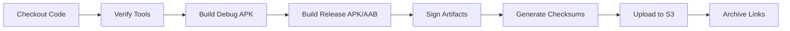
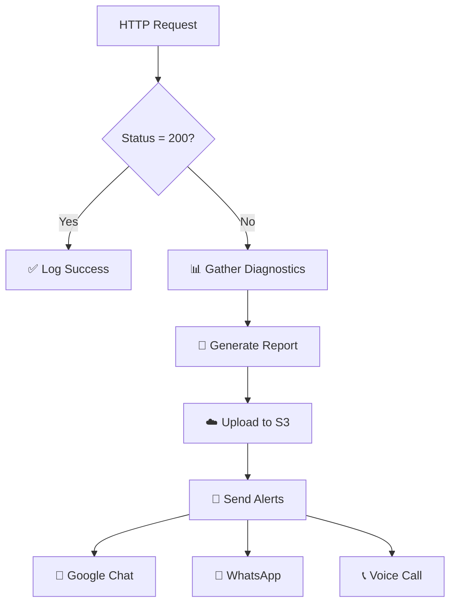
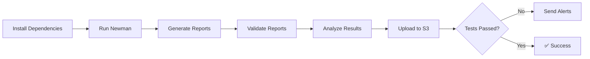

<div align="center">

# 🩺 Health Check & Build Automation

[](https://www.jenkins.io/)
[](https://aws.amazon.com/s3/)
[](https://www.postman.com/)
[](https://developer.android.com/)

**Automated Jenkins pipelines for production monitoring, API testing, and mobile builds**

[Features](#-features) • [Quick Start](#-quick-start) • [Modules](#-modules) • [Configuration](#-configuration)

---

</div>

## ✨ Features

<table>
<tr>
<td width="50%">

### 🌐 Website Monitoring
- Real-time health checks for production sites
- Multi-channel alerts (Chat, WhatsApp, Voice)
- Detailed failure diagnostics & reports
- Automated S3 report archival

</td>
<td width="50%">

### 💳 API Testing
- Postman/Newman integration
- Rich HTML & JSON reports
- Branch-aware test execution
- Smart failure notifications

</td>
</tr>
<tr>
<td width="50%">

### 📱 Android Builds
- Automated APK/AAB generation
- Code signing & verification
- SHA256 checksum validation
- S3 artifact distribution

</td>
<td width="50%">

### 🔧 Infrastructure
- Jenkins pipeline automation
- AWS S3 integration
- Twilio alert system
- Google Chat notifications

</td>
</tr>
</table>

---

## 📋 Table of Contents

- [✨ Features](#-features)
- [🗂️ Repository Structure](#️-repository-structure)
- [🎯 Modules](#-modules)
  - [Android APK Builder](#1-android-apk-builder-android_apk_builder)
  - [Bizup Health Check](#2-bizup-website-health-check-bizup_health_check)
  - [Navo Health Check](#3-navo-website-health-check-navo_health_check)
  - [Payment API Check](#4-payment-api-health-check-payment_health_check)
- [� Configuration](#-configuration)
- [🚀 Quick Start](#-quick-start)
- [📦 Prerequisites](#-prerequisites)

---

## 🗂️ Repository Structure

```
📦 health_check_scripts
├── 📱 android_apk_builder/
│   └── jenkinsfile                    # Android build pipeline
│
├── 🌐 bizup_health_check/
│   └── jenkinsfile                    # Bizup.app monitoring
│
├── 🌐 navo_health_check/
│   └── jenkinsfile                    # Navofashion.in monitoring
│
├── 💳 payment_health_check/
│   ├── .gitignore
│   ├── Payment Health Check.postman_collection.json
│   ├── Readme.md                      # Detailed module docs
│   ├── jenkinsfile                    # API testing pipeline
│   └── package.json                   # Node dependencies
│
├── .gitignore
└── README.md                          # You are here
```

### 📦 Module Overview

<details open>
<summary><b>📱 android_apk_builder</b> - Android Build Automation</summary>
<br>

Automated pipeline for building, signing, and distributing Android artifacts.

**Key Features:**
- ✅ Debug & Release APK builds
- ✅ AAB (Android App Bundle) generation
- ✅ Automated code signing
- ✅ SHA256 checksum generation
- ✅ S3 artifact upload with public URLs

</details>

<details open>
<summary><b>🌐 bizup_health_check</b> - Bizup Website Monitor</summary>
<br>

Real-time monitoring for `https://bizup.app` with comprehensive alerting.

**Key Features:**
- ✅ HTTP status monitoring (200 OK check)
- ✅ SSL verification & diagnostics
- ✅ Geolocation tracking
- ✅ Multi-channel alerts (Google Chat, WhatsApp, Voice)
- ✅ Detailed failure reports to S3

</details>

<details open>
<summary><b>🌐 navo_health_check</b> - Navo Website Monitor</summary>
<br>

Identical monitoring setup for `https://navofashion.in`.

**Key Features:**
- ✅ Same robust monitoring as Bizup
- ✅ Separate S3 report storage
- ✅ Branded Navo alerts

</details>

<details open>
<summary><b>💳 payment_health_check</b> - Payment API Testing</summary>
<br>

Postman/Newman-based API testing with intelligent reporting.

**Key Features:**
- ✅ Automated Postman collection execution
- ✅ HTML & JSON report generation
- ✅ Branch-aware S3 paths
- ✅ Detailed failure analysis
- ✅ Smart Google Chat notifications

📖 **[View detailed documentation →](payment_health_check/Readme.md)**

</details>

---

## 🔧 Configuration

### 🏗️ Infrastructure Requirements

| Component | Requirement | Purpose |
|-----------|-------------|---------|
| **Jenkins** | Pipeline support enabled | CI/CD orchestration |
| **AWS S3** | Bucket: `bizup-builds`<br>Region: `ap-south-1` | Artifact storage |
| **AWS CLI** | Configured on agents | S3 operations |
| **curl** | Available on agents | HTTP health checks |

### 🔐 Jenkins Credentials Setup

> **Important:** Credential IDs must match exactly as shown below.

<details>
<summary><b>☁️ AWS S3 Access</b></summary>

```yaml
Credential ID: aws-s3-creds
Type: Username with Password
Username: <AWS Access Key ID>
Password: <AWS Secret Access Key>
```

</details>

<details>
<summary><b>💬 Google Chat Webhook</b></summary>

```yaml
Credential ID: google-chat-webhook
Type: Secret Text
Value: <Google Chat Incoming Webhook URL>
```

</details>

<details>
<summary><b>📱 Twilio (WhatsApp & Voice Alerts)</b></summary>

```yaml
Credential ID: twilio-sid
Type: Secret Text
Value: <Twilio Account SID>

Credential ID: twilio-token
Type: Secret Text
Value: <Twilio Auth Token>
```

</details>

<details>
<summary><b>🤖 Android Build & Signing</b></summary>

```yaml
Credential ID: jenkins-key
Type: SSH Username with Private Key
Description: Git access for git@github.com:Bizup-world/android.git

Credential ID: ANDROID_RELEASE_KEYSTORE
Type: Secret File
File: <Upload your .keystore file>

Credential ID: ANDROID_KEYSTORE_PASS
Type: Secret Text
Value: <Keystore Password>

Credential ID: ANDROID_KEY_ALIAS
Type: Secret Text
Value: <Key Alias>

Credential ID: ANDROID_KEY_PASS
Type: Secret Text
Value: <Key Password>
```

</details>

---

## 🎯 Modules

### 1️⃣ Android APK Builder

> **Path:** `android_apk_builder/jenkinsfile`

#### 📝 Purpose
Automate building, signing, and publishing Android app artifacts for Bizup to S3.

#### 🔄 Pipeline Workflow



**Steps:**
1. 📥 Checkout Android repo (branch: `BRANCH_NAME`, default: `develop`)
2. ✅ Verify Java 17, Android SDK, and Gradle
3. 🔨 Build debug APKs with Bizup naming pattern
4. 🔨 Build signed release APK + AAB
5. 🔐 Apply signing credentials
6. #️⃣ Generate SHA256 checksums
7. ☁️ Upload artifacts to S3
8. 📋 Generate `artifacts/s3_links.txt` with public URLs
9. 📦 Archive all artifacts in Jenkins

#### ⚙️ Jenkins Setup

**Pipeline Configuration:**
```groovy
Script Path: android_apk_builder/jenkinsfile
Parameters:
  - BRANCH_NAME (String): Android branch to build
```

**Agent Requirements:**

| Tool | Version/Path | Purpose |
|------|--------------|---------|
| Java | 17 | Build runtime |
| Android SDK | `/opt/android-sdk` | Build tools |
| Build Tools | `34.0.0` | APK/AAB generation |
| Gradle | Wrapper in repo | Build system |
| AWS CLI | In PATH | S3 uploads |

---

### 2️⃣ Bizup Website Health Check

> **Path:** `bizup_health_check/jenkinsfile`  
> **Target:** `https://bizup.app`

#### 📝 Purpose
Proactive monitoring with multi-channel alerting for production website availability.

#### 🔄 Monitoring Flow



#### 🚨 Alert Behavior

**On Success (Status 200):**
- ✅ Log success message
- 📝 Update build description

**On Failure (Status ≠ 200):**

<table>
<tr>
<td width="50%">

**📊 Diagnostics Collected**
- ⏰ Timestamp
- 🏗️ Jenkins build info
- ⚡ Response time
- 🔒 SSL verification status
- 🌍 Server geolocation (ip-api.com)

</td>
<td width="50%">

**🔔 Alert Channels**
- 💬 **Google Chat**: Rich card message
- 📱 **WhatsApp**: Multi-recipient via Twilio
- 📞 **Voice Call**: Multi-recipient via Twilio

</td>
</tr>
</table>

**Report Storage:**
- 📁 Local: `health_check_reports/`
- ☁️ S3: `bizup-health-check-report/` prefix
- 📦 Archived in Jenkins artifacts

#### ⚙️ Jenkins Setup

**Pipeline Configuration:**
```groovy
Script Path: bizup_health_check/jenkinsfile
Trigger: Cron (e.g., */5 * * * * for every 5 minutes)
```

**Network Access Required:**
- ✅ `https://bizup.app`
- ✅ `http://ip-api.com`
- ✅ Twilio API endpoints
- ✅ Google Chat webhook URL

---

### 3️⃣ Navo Website Health Check

> **Path:** `navo_health_check/jenkinsfile`  
> **Target:** `https://navofashion.in`

#### 📝 Purpose
Identical monitoring setup as Bizup, tailored for Navo Fashion website.

#### 🔄 Key Differences

| Aspect | Navo | Bizup |
|--------|------|-------|
| **URL** | `https://navofashion.in` | `https://bizup.app` |
| **S3 Prefix** | `navo-health-check-report/` | `bizup-health-check-report/` |
| **Alert Branding** | Navo Health Check | Bizup Health Check |

#### ⚙️ Jenkins Setup

**Pipeline Configuration:**
```groovy
Script Path: navo_health_check/jenkinsfile
Trigger: Cron (e.g., */5 * * * * for every 5 minutes)
Credentials: Same as Bizup health check
```

> **Note:** All monitoring features, alert channels, and diagnostics are identical to the Bizup health check.

---

### 4️⃣ Payment API Health Check

> **Path:** `payment_health_check/jenkinsfile`

#### 📝 Purpose
Automated Postman/Newman API testing with rich reporting and intelligent notifications.

#### 📦 Components

```
payment_health_check/
├── Payment Health Check.postman_collection.json  # API test collection
├── package.json                                  # Node dependencies
└── jenkinsfile                                   # CI/CD pipeline
```

#### 🔄 Pipeline Workflow



**Pipeline Steps:**
1. 📦 Install Node dependencies + Newman
2. 🧪 Run Newman with JSON & HTML reporters
3. 🔄 Retry logic for network flakiness
4. ✅ Validate report freshness
5. 📊 Analyze pass/fail counts
6. ☁️ Upload HTML to S3 (`API_Automation/` + branch path)
7. 🔔 Send failure notifications to Google Chat

#### 💻 Local Development

**Setup:**
```bash
cd payment_health_check
npm install
```

**Run Tests:**
```bash
npm run test        # CLI output only
npm run test:json   # CLI + JSON report
npm run test:html   # CLI + HTML report
npm run test:all    # CLI + JSON + HTML reports
```

#### ⚙️ Jenkins Setup

**Pipeline Configuration:**
```groovy
Script Path: payment_health_check/jenkinsfile
```

**Agent Requirements:**
- ✅ Node.js runtime
- ✅ NVM (Node Version Manager)
- ✅ Newman (installed by pipeline)
- ✅ AWS CLI

📖 **[View detailed documentation →](payment_health_check/Readme.md)**

---

## 🚀 Quick Start

### Step-by-Step Setup Guide

<details open>
<summary><b>1️⃣ Clone Repository</b></summary>

```bash
git clone <repo-url>
cd health_check_scripts
```

</details>

<details open>
<summary><b>2️⃣ Configure Jenkins Credentials</b></summary>

Set up all credentials as documented in the [Configuration](#-configuration) section.

**Required Credentials:**
- ☁️ AWS S3 Access (`aws-s3-creds`)
- 💬 Google Chat Webhook (`google-chat-webhook`)
- 📱 Twilio SID & Token (for health checks)
- 🤖 Android signing keys (for APK builder)

</details>

<details open>
<summary><b>3️⃣ Create Jenkins Pipeline Jobs</b></summary>

For each module you want to use:

1. Create a new Pipeline job in Jenkins
2. Set **Pipeline script from SCM**
3. Configure the script path:
   - `android_apk_builder/jenkinsfile`
   - `bizup_health_check/jenkinsfile`
   - `navo_health_check/jenkinsfile`
   - `payment_health_check/jenkinsfile`

</details>

<details open>
<summary><b>4️⃣ Install Agent Tools</b></summary>

**Common Tools (All Agents):**
```bash
# AWS CLI
aws --version

# curl
curl --version
```

**Android Builder Agent:**
```bash
# Java 17
java -version

# Android SDK
export ANDROID_SDK_ROOT=/opt/android-sdk

# Gradle (via wrapper in repo)
./gradlew --version
```

**Payment Health Check Agent:**
```bash
# Node.js
node --version

# NVM (Node Version Manager)
nvm --version
```

</details>

<details open>
<summary><b>5️⃣ Schedule Monitoring Jobs</b></summary>

For continuous monitoring, configure cron triggers:

**Example Cron Expressions:**
```groovy
// Every 5 minutes
triggers { cron('*/5 * * * *') }

// Every 10 minutes
triggers { cron('*/10 * * * *') }

// Every hour
triggers { cron('0 * * * *') }
```

Apply to:
- ✅ Bizup health check
- ✅ Navo health check
- ✅ Payment API health check (optional)

</details>

---

## 📦 Prerequisites

### Infrastructure
- ✅ Jenkins server with pipeline plugin
- ✅ AWS S3 bucket: `bizup-builds` (region: `ap-south-1`)
- ✅ Jenkins agents with appropriate tools installed

### External Services
- ✅ Google Chat workspace with webhook
- ✅ Twilio account (for SMS/Voice alerts)
- ✅ GitHub access (for Android repo)

### Network Access
- ✅ Production websites (bizup.app, navofashion.in)
- ✅ Payment APIs
- ✅ AWS S3 endpoints
- ✅ Twilio API endpoints
- ✅ Google Chat webhook URL

---

<div align="center">

## 📞 Support & Contribution

**Questions?** Open an issue or contact the DevOps team.

**Want to contribute?** PRs are welcome!

---

Made with ❤️ by the Bizup DevOps Team

**[⬆ Back to Top](#-health-check--build-automation)**

</div>
